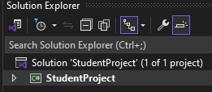
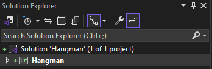
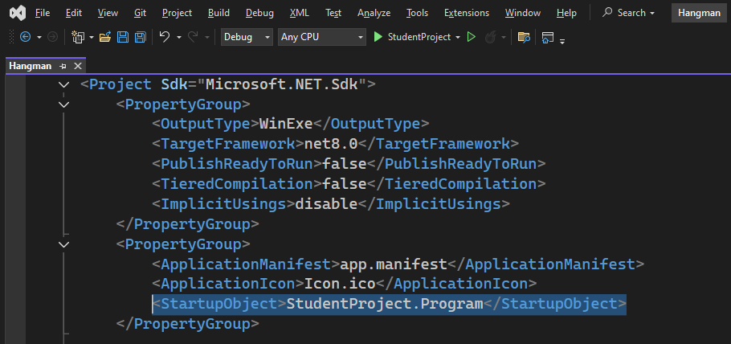
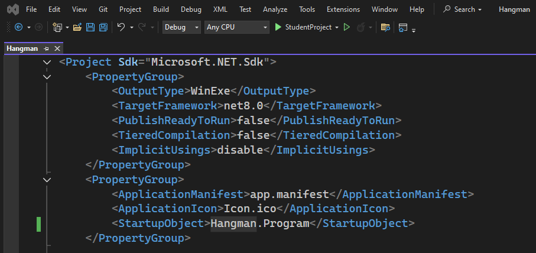
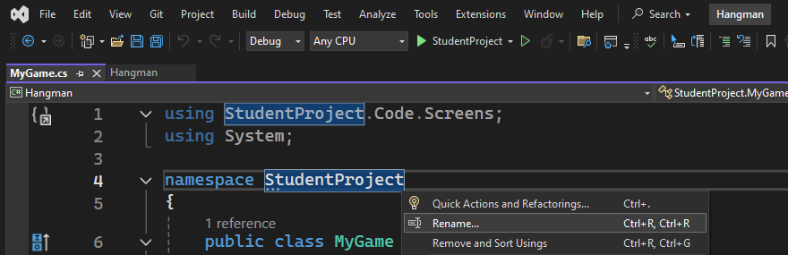
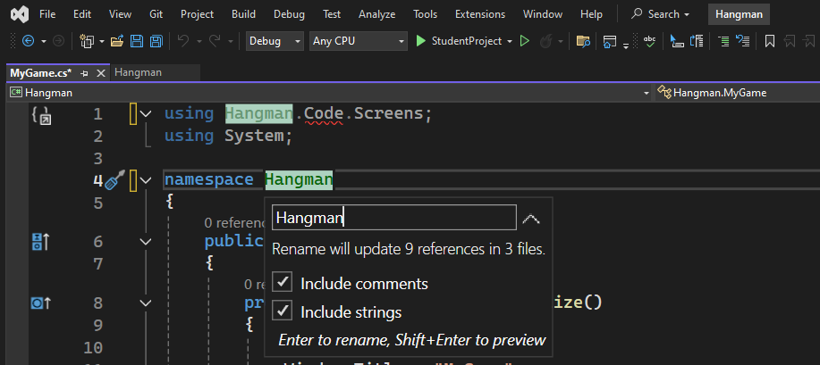
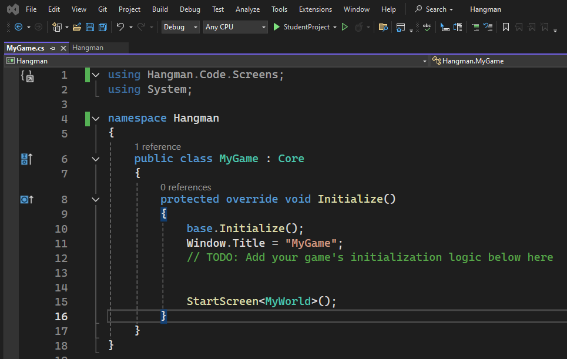
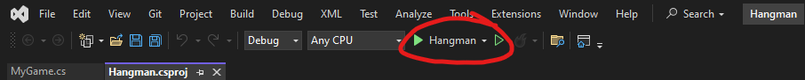

# How to change the Project Name
For this example, I renamed the StudentProject to Hangman. Any name should work, but I'd use - or _ instead of spaces.


1. Unzip the BlankStarterProject
2. Open the solution in Visual Studio 2022 (StudentProject.sln)
3. Go to the top right Solution Explorer and rename the Project and Solution to the new name.<br><br>

<br><br>
4. Staying at the Solution Explorer, double click the project. It is the one that DOESN'T say Solution 'NewName' (1 of 1 Project). <br>
This should bring up a NewName.csproj file if its not displayed already. Find StartupObject (its near the top) and rename it to the new name.
<br>

<br><br>
5. Finally, go to your MyGame.cs file and double click any text that says StudentProject. Right Click and select Rename. Tick both the Include Comments and Include Strings Boxes and type in the new name. Press enter to complete.
<br>
<br>

<br><br>
6. Now, save and close Visual Studio and reopen it. Everything should be working, and the Solutions name should have updated.<br><br>
<br><br>

Please note: This does not change the StudentProject folder that everything is stored in. If you want to change it, then you also have to open the .sln file in notepad and manually change the path. While this does work, it might screw up some dependency somewhere, so I'm too scared to try it.


### Resolving Errors
If you follow these steps on some versions of the StudentProject zip, you might get this error "Error  : The project file could not be loaded. Data at the root level is invalid. Line 1, position 1." 

If this happens, the fix is simple. Open file explorer, and navigate to where you've stored your files. Open the StudentProject folder, and find the .csproj file. It will have the same name as your new project name. For me, thats Hangman.csproj.

Open the .csproj in a text editor (notepad is fine). The very first line should say something like:
```
Hangman<Project Sdk="Microsoft.NET.Sdk">
```

This is incorrect. Remove the name so the first line starts with a <Project

```
<Project Sdk="Microsoft.NET.Sdk">
```

Now, restart the program and it should work fine. I have 0 idea why it does this.  


