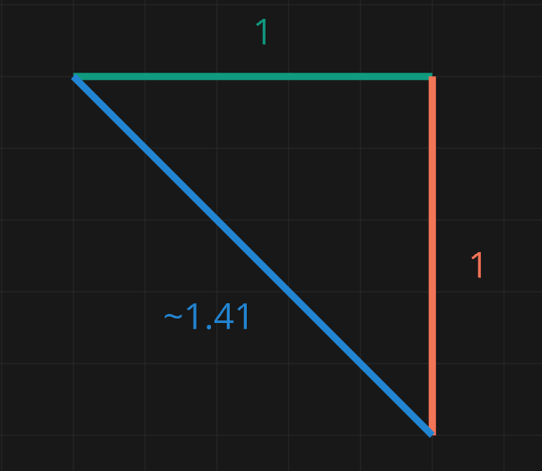

# Vector2
#### Why they matter
A Vector is a type of matrix, specifically a Matrix with only 1 column (Column Matrix). Vector2 just means it has 2 rows and 1 column.
Thats right, our Math class is actually important for Game Dev!

Why is this important? Well its a great way of storing data. A Vector2 can store the X and Y coordinates of an object.  
If you think about it, the easy way of storing coordinates (24, 32) is really just a column matrix.


A separate Vector2 can also store the X and Y Velocity.  

The velocity combines 2 key pieces of information:
- The direction its going on the X and Y axis (which is a unit vector)
- The speed of the object (magnitude)


| Direction | Vector |
| :---: | :---: |
| `Right`        | (1, 0) |
| `Left`         | (-1, 0) |
| `Down`         | (0, 1) |
| `Up`           | (0, -1) |
| `Right + Down` | (1, 1) |
| `Right + Up`   | (1, -1) |
| `Left + Down`  | (-1, 1) |
| `Left + Up`    | (1, -1) |

# Normalizing Vectors
### Why Do we Normalize Vectors?
Normalizing Vectors means changing it's overall length (in maths called the magnitude) to 1 while maintaining its direction.  
This is important for Game Development, because if you don't normalize, the player will go FASTER if they go diagonally.  


You can think of this in terms of the pythagoras theorem. 
- If the player is going Right, their magnitude is 1 
- If the player is going straight down, their magnitude is 1.
- If the player is going Right AND Down, their magnitude is ~1.41

This means if you go diagonally, you will go ~40% faster, which can obviously be a problem.   (This is why in old games like Doom, moving diagonally would get you more speed.)

For example:
- If the player is going only RIGHT, your nomalized vector would be (1, 0)
- If the player is going only DOWN, your nomalized vector would be (0, 1)
- If the player is going Right AND Down, your vector would go from (1, 1) to (~0.7, ~0.7)

| Direction | Vector | Normalized |
| :---: | :---: | :---: |
| `Right`        | (1, 0) | (1, 0) |
| `Down`         | (0, 1) | (0, 1) |
| `Right + Down` | (1, 1) | (0.7, 0.7) |
| `Right + Up`   | (1, -1) | (0.7, -0.7) |
| `Left + Up`    | (-1, -1) | (-0.7, -0.7) |
| `Half Right + Half Down` | (0.5, 0.5) | (0.7, 0.7) |
| `Half Right` | (0.5, 0) | (1, 0) |


It's worth remembering that normalizing a vector still maintains it direction. 

So if your going right and only a tiny bit down, the normalized vector will maintain that.

| Direction | Vector | Normalized |
| :---: | :---: | :---: |
| `Right + Little Down` | (1, 0.2) | (0.98, 0.19) |
| `Left + Half Up` | (-1, -0.5) | (0.98, 0.19) |  

#### Messing with Vectors
If you want to mess about with normalizing Vectors, copy with code below and put it in a MonoGameEngine project and run it.
```C#
Vector2 TestVector = new Vector2(0.5f, 0.5f); // Change the numbers here
Vector2 NormalizedVector = TestVector;
NormalizedVector.Normalize();
Debug.WriteLine($"{TestVector} : {NormalizedVector}");

// If you get an error on Debug.Writeline, right click it, go to the top where it says `Quick actions and refactoring`, and press `using diagnostics`.
```

### Adding SPEED
Once the Vector is normalized, then you can apply the magnitude (the speed of the object). Don't apply the speed before hand, because normalizing the vector will lose it.

    Both (1, 1) and (900, 900) becomes (~0.7, ~0.7) when normalized.


### Lets put this in Practice
Lets say the player wants to go right and half down.

```C#
Vector2 playerVector = new Vector2(1.0f, 0.5f);
playerVector.Normalize();
// {X:0.8944272 Y:0.4472136}

playerVector *= 200;
// {X:178.88544 Y:89.44272}
```

### Normalizing an empty Vector
If you try and normalize an completely empty vector (0, 0), it will return NaN, which will break your program.

Therefore, it's important to check that your vector isn't empty before normalizing.
```C#
if (playerVector != new Vector2(0, 0))
{
    playerVector.Normalize
}
```

### When NOT to Normalize Vectors
Not every game should normalize their vectors. 

If you make a 2D Platformer, and normalize the vectors, that will cause jumping to be slower than running, which feels bad to play.

However, if you make a game like Space Shooter where you can move in every direction, then I would generally normakize.

Also, Normalizing should be done not just for the players, but enemies, and anything else that moves.

